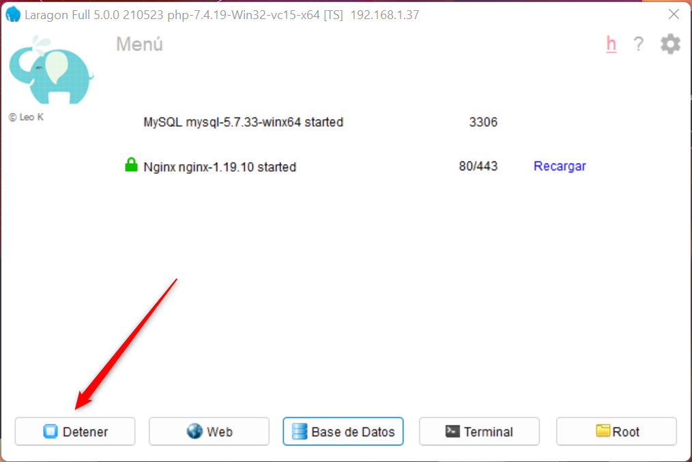
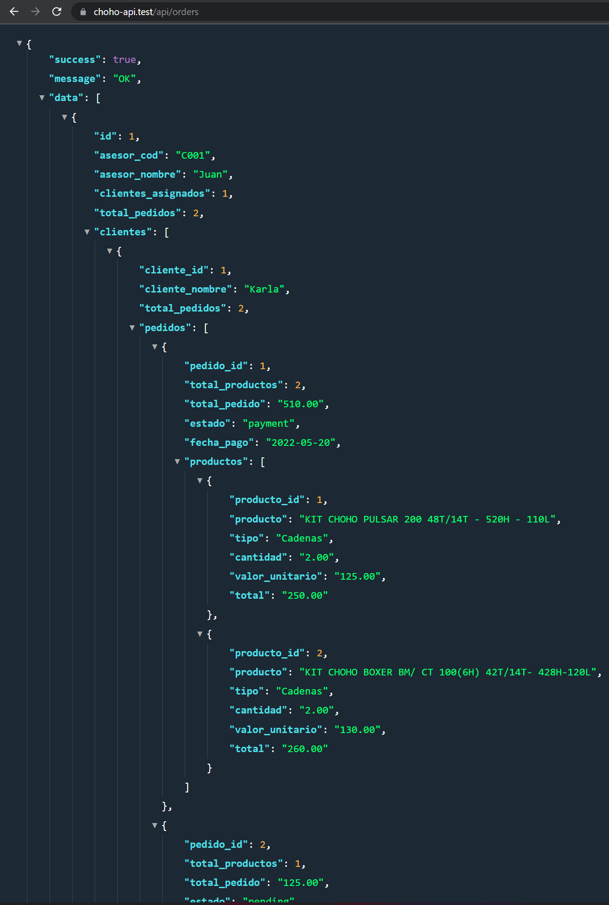

# API REST - Solución a prueba técnica

Para Dessarrolar la prueba en cuestión se usó PHP como lenguaje de programación, con el framework Laravel Lumen en su versión 8:

## Requisitos para ejecutar el proyecto de manera local
- PHP >= 7.3
- MYSQL >= 5.7
- Laragon - entorno de desarrollo local moderno para windows
## Manual de Instalación (entorno local)

1. Desde la consola diríjase a la carpeta C:\laragon\www\
2. Clona o descarga el proyecto del siguiente respositorio: [http://github.com/sjaureguio/choho-api](http://github.com/sjaureguio/choho-api "Clic")
3. En la ruta del proyecto, ejecuta los siguientes comandos  
    
    <code>- composer install</code> 
    <code>- cp .env.example .env</code> 
    <code>- php artisan key:generate</code>
    
4. Crear una bd con el nombre de "choho"
5. En la carpeta public del proyecto se encuentra la BD con el nombre de <strong>choho.sql</strong>. El cuál, debe de ser restablecido.
6. Reiniciar laragon  
    
7. Para ver el resultado ingresar a la siguiente url: [http://choho-api.test/api/orders](https://choho-api.test/api/orders)    
    
7. Finalmente, para ver el resultado en una vista ingresar a: [http://choho-api.test/orders](http://choho-api.test/orders)    

